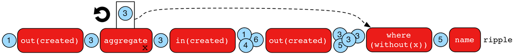

# 聚合步骤



`aggregate()`步骤（sideEffect）用来在一个专门的点聚合所有的对象进入一个集合中。这一步骤会立刻求值，直到所有的对象都聚合完成（相反的`store()`会延迟求值）。这种立刻求值的特性对于在一些特殊的需要将所有的对象都进行计算的状态中是很重要的。举个例子：

```groovy
gremlin> g.V(1).out('created') //1\
==>v[3]
gremlin> g.V(1).out('created').aggregate('x') //2\
==>v[3]
gremlin> g.V(1).out('created').aggregate('x').in('created') //3\
==>v[1]
==>v[4]
==>v[6]
gremlin> g.V(1).out('created').aggregate('x').in('created').out('created') //4\
==>v[3]
==>v[5]
==>v[3]
==>v[3]
gremlin> g.V(1).out('created').aggregate('x').in('created').out('created').
                where(without('x')).values('name') //5\
==>ripple
```

1. marko写了什么软件？
2. 聚合他所有的软件。
3. 谁是marko的同事？
4. marko的同事写了什么软件？
5. marko的同事写了什么软件是marko没有参与编写的？

在一个推荐系统中，有如下表达式：

```
用户A喜欢什么？有谁也喜欢？他们有什么用户A还没喜欢的？
```

最后，`aggregate()`步骤可以通过`by()`调整。

```groovy
gremlin> g.V().out('knows').aggregate('x').cap('x')
==>[v[2],v[4]]
gremlin> g.V().out('knows').aggregate('x').by('name').cap('x')
==>[vadas,josh]
```

