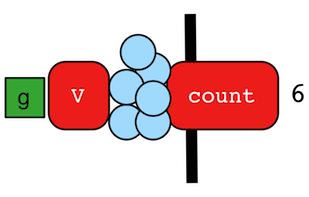

# count步骤



`count()`步骤(map)在流中统计遍历所传递的对象的数量。

```groovy
gremlin> g.V().count()
==>6
gremlin> g.V().hasLabel('person').count()
==>4
gremlin> g.V().hasLabel('person').outE('created').count().path() //1\
==>[4]
gremlin> g.V().hasLabel('person').outE('created').count().map {it.get() * 10}.path() //2\
==>[4,40]
```

1. `count()`步骤是一个换算屏障步骤,所有之前的遍历都折叠到了新的遍历中。
2. 由`count()`生成的遍历是以`count()`为起点的。

> `count()`统计当前的，本地的对象（不是遍历流中的对象）。它可以在`Collection`和`Map`类型的对象起作用。对大多数其他对象，他会返回1。

