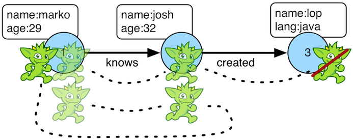

# cyclic步骤



每一个遍历都有它所遍历过的图的历史，就是他的路径。如果遍历存在重复路径很重要，那么就可以使用`cyclic()`路径来筛选(filter)。这个步骤解析了因为重复而到此的遍历，不重复的遍历会被过滤掉。如果想要获取不重复的遍历，请看`simplePath()`

```Groovy
gremlin> g.V(1).both().both()
==>v[1]
==>v[4]
==>v[6]
==>v[1]
==>v[5]
==>v[3]
==>v[1]
gremlin> g.V(1).both().both().cyclicPath()
==>v[1]
==>v[1]
==>v[1]
gremlin> g.V(1).both().both().cyclicPath().path()
==>[v[1],v[3],v[1]]
==>[v[1],v[2],v[1]]
==>[v[1],v[4],v[1]]
gremlin> g.V(1).as('a').out('created').as('b').
           in('created').as('c').
           cyclicPath().
           path()
==>[v[1],v[3],v[1]]
gremlin> g.V(1).as('a').out('created').as('b').
           in('created').as('c').
           cyclicPath().from('a').to('b').
           path()
```

