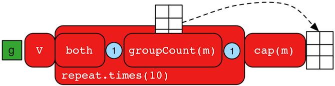

# groupCount Step

当我们需要知道在一个遍历过程中一个特殊的对象出现过多少次时，`groupCount()`步骤(map/sideEffect)就可以派上用场了。

`图中年龄的分布情况如何？`

```groovy
gremlin> g.V().hasLabel('person').values('age').groupCount()
==>[32:1,35:1,27:1,29:1]
gremlin> g.V().hasLabel('person').groupCount().by('age') //1\
==>[32:1,35:1,27:1,29:1]
```

1. 你可以先提供一个预先分组的提示，然后再使用`by()`来表明需要将哪些对象分组。

这里问题中分别有一个32,35,27和29岁的人。

`遍历迭代计算图中每一个名字的第二个字母出现的次数。`



```groovy
gremlin> g.V().repeat(both().groupCount('m').by(label)).times(10).cap('m')
==>[software:19598,person:39196]
```

上面这个查询有趣的地方在于他演示了将`groupCount()`当做`Map<Object,Long>`来使用字符串参数调用。此时`groupCount()`是一个副作用步骤，它只是将他所获取到的对象原封不动的传递给输出。在循环内部的`groupCount()`会自行统计对象，逐渐递增。