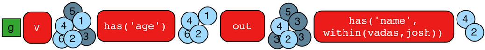

# has-Step



用`has()`步骤(filter)可以筛选节点，边和节点属性。`has()`步骤有许多种参数：

- `has(key, value)`:移除没有参数中键值对属性的元素。
- `has(label, key, value)`:移除非指定标签和不包含参数中键值对属性的所有元素。
- `has(key, predicate)`:移除不包含符合键值条件的元素。
- `hasLabel(labels...)`:移除不是所提供label的元素。
- `hasId(ids...)`:移除不是所提供id的元素。
- `hasKey(keys...)`:移除不包含所有提供的键的元素。
- `hasValue(values...)`:移除不包含所有提供的值的元素。
- `has(key)`:移除所有不包含该键的元素。
- `hasNot(key)`:移除所有该键有值的元素。
- `has(key, traversal)`:移除不能通过所提供键对应值进行遍历返回结果的元素。

```groovy
gremlin> g.V().hasLabel('person')
==>v[1]
==>v[2]
==>v[4]
==>v[6]
gremlin> g.V().hasLabel('person').out().has('name',within('vadas','josh'))
==>v[2]
==>v[4]
gremlin> g.V().hasLabel('person').out().has('name',within('vadas','josh')).
               outE().hasLabel('created')
==>e[10][4-created->5]
==>e[11][4-created->3]
gremlin> g.V().has('age',inside(20,30)).values('age') //1\
==>29
==>27
gremlin> g.V().has('age',outside(20,30)).values('age') //2\
==>32
==>35
gremlin> g.V().has('name',within('josh','marko')).valueMap() //3\
==>[name:[marko],age:[29]]
==>[name:[josh],age:[32]]
gremlin> g.V().has('name',without('josh','marko')).valueMap() //4\
==>[name:[vadas],age:[27]]
==>[name:[lop],lang:[java]]
==>[name:[ripple],lang:[java]]
==>[name:[peter],age:[35]]
gremlin> g.V().has('name',not(within('josh','marko'))).valueMap() //5\
==>[name:[vadas],age:[27]]
==>[name:[lop],lang:[java]]
==>[name:[ripple],lang:[java]]
==>[name:[peter],age:[35]]
gremlin> g.V().properties().hasKey('age').value() //6\
==>29
==>27
==>32
==>35
gremlin> g.V().hasNot('age').values('name') //7\
==>lop
==>ripple
```

1. 找出所有年龄在20到30的节点。
2. 找出所有年龄不在20到30的节点。
3. 找出所有名字为`[josh,marko]`的节点，显示这些节点的属性键值对。
4. 找出所有名字不为`[josh,marko]`的节点，显示这些节点的属性键值对。
5. 和上条相同的目标，不同的表示方式，使用`not`在`within`前来代替`without`。
6. 获取所有的有年龄属性的点的该属性的值。
7. 获取所有的没有年龄属性节点的名称。

TinkerPop在判断中不支持正则表达式，但是某些基于tinkerpop的图数据库可能会提供这方面的扩展。