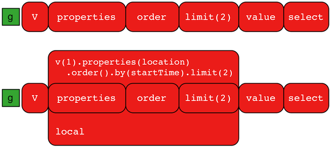

# local步骤



一个`GraphTraversal`操作会有一个连续的对象流。在许多情况中，去操作流中特定的单个元素是非常有必要的。对于这样的位于遍历中的对象的计算，我们就可以使用`local()`步骤(branch)。

```groovy
gremlin> g.V().as('person').
               properties('location').order().by('startTime',incr).limit(2).value().as('location').
               select('person','location').by('name').by() //1\
==>[person:daniel,location:spremberg]
==>[person:stephen,location:centreville]
gremlin> g.V().as('person').
               local(properties('location').order().by('startTime',incr).limit(2)).value().as('location').
               select('person','location').by('name').by() //2\
==>[person:marko,location:san diego]
==>[person:marko,location:santa cruz]
==>[person:stephen,location:centreville]
==>[person:stephen,location:dulles]
==>[person:matthias,location:bremen]
==>[person:matthias,location:baltimore]
==>[person:daniel,location:spremberg]
==>[person:daniel,location:kaiserslautern]
```

1. 根据获取最早的所在地的两个人。
2. 获取每个人的最初的所在地。

这两个遍历看起来非常相似，除了第二句中使用`local()`包起了遍历中的一部分。这时，`order().by`和`limit()`就只作用到了特定的对象上，而不是所有的流中的对象。

local步骤很像Flat Map步骤导致我们总是会弄混他们。`local()`通过其内部的遍历器遍历，而不是分裂或者克隆他们。因此，这是一个本地处理的全局遍历。他的使用十分巧妙，且可以在编译优化中使用（比如我们在实现`TraversalStrategy`时），下面是另一个例子：

```groovy
gremlin> g.V().both().barrier().flatMap(groupCount().by("name"))
==>[lop:1]
==>[lop:1]
==>[lop:1]
==>[vadas:1]
==>[josh:1]
==>[josh:1]
==>[josh:1]
==>[marko:1]
==>[marko:1]
==>[marko:1]
==>[peter:1]
==>[ripple:1]
gremlin> g.V().both().barrier().local(groupCount().by("name"))
==>[lop:3]
==>[vadas:1]
==>[josh:3]
==>[marko:3]
==>[peter:1]
==>[ripple:1]
```

> 匿名遍历`local()`会遍历当前的部分对象。在OLAP中，计算的原子单位就是定点和其局部的“星图”，重要的是匿名的遍历不会离开顶点的星图，换句话说，遍历并不会扩散。

