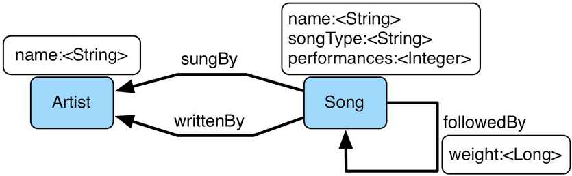

# match步骤

`match()`步骤(map)提供了更多的基于模式匹配的图查询声明方式。使用`match()`，用户可以提供一组叫做模式的遍历片段，他定义了在`match()`中必须为真的变量。当遍历器在`match()`中时，一个注册了的`MatchAlgorithm`会分析当前的遍历器的状态（比如根据他的遍历路径数据获取他的历史），还有运行时的遍历模式统计，然后返回一个遍历器应该尝试的遍历模式。默认的`MatchAlgorithm`叫做`CountMatchAlgorithm`，他会根据其过滤能力对模式进行分类动态的修改执行计划（比如最大的reduce最先执行）。在很大的图上，开发者并不确定图的具体统计数据（比如在图中有很多`knows`边和`worksFor`边），最好使用`match()`来作为一个优化策略。在一些单路径遍历中，`match()`也能更简单的表示。

```
"Who created a project named 'lop' that was also created by someone who is 29 years old? Return the two creators."
```


```groovy
gremlin> g.V().match(
                 __.as('a').out('created').as('b'),
                 __.as('b').has('name', 'lop'),
                 __.as('b').in('created').as('c'),
                 __.as('c').has('age', 29)).
               select('a','c').by('name')
==>[a:marko,c:marko]
==>[a:josh,c:marko]
==>[a:peter,c:marko]
```

注意上面的遍历也可以更简单的使用下面演示的标准内遍历任意定义。

```groovy
gremlin> g.V().match(
                 __.as('creators').out('created').has('name', 'lop').as('projects'), //1\
                 __.as('projects').in('created').has('age', 29).as('cocreators')). //2\
               select('creators','cocreators').by('name') //3\
==>[creators:marko,cocreators:marko]
==>[creators:josh,cocreators:marko]
==>[creators:peter,cocreators:marko]
```

1. 将创始人作为‘creators’，查询创始人名称为‘lop’的定点，并将结果命名为‘projects’。
2. 使用‘projects’节点，查找29岁创始人的创始人，并命名为‘cocreators’。
3. 返回‘creators’和‘cocreators’。



`MatchStep`有些像SPARQL。和SPARQL一样，`MatchStep`合并了模式并在图上应用。举个例子，下面这个遍历查找了Jerry Garcia 自写自唱的歌：

```groovy
gremlin> graph.io(graphml()).readGraph('data/grateful-dead.xml')
gremlin> g = graph.traversal()
==>graphtraversalsource[tinkergraph[vertices:808 edges:8049], standard]
gremlin> g.V().match(
                 __.as('a').has('name', 'Garcia'),
                 __.as('a').in('writtenBy').as('b'),
                 __.as('a').in('sungBy').as('b')).
               select('b').values('name')
==>CREAM PUFF WAR
==>CRYPTICAL ENVELOPMENT
```

`match()`和SPARQL不一样的地方在于：

```groovy
gremlin> g.V().match(
                 __.as('a').out('created').has('name','lop').as('b'), //1\
                 __.as('b').in('created').has('age', 29).as('c'),
                 __.as('c').repeat(out()).times(2)). //2\
               select('c').out('knows').dedup().values('name') //3\
==>vadas
==>josh
```

1. 任意复杂度的模式：`match()`可以不受限制的遍历三个模式或属性路径。
2. 递归支持：`match()`支持基于分支步骤的递归，包括`repeat()`。
3. 命令和声明混合：在`match()`前后，都可以使用正常的Gremlin遍历。

对于扩展第三点，有可能支持从命令，到声明，到命令，到无限多句混合。

```groovy
gremlin> g.V().match(
                 __.as('a').out('knows').as('b'),
                 __.as('b').out('created').has('name','lop')).
               select('b').out('created').
                 match(
                   __.as('x').in('created').as('y'),
                   __.as('y').out('knows').as('z')).
               select('z').values('name')
==>vadas
==>josh
```

> `match()`步骤本身并没有状态。绑定在遍历模式上的变量都存储在遍历器的历史路径中。因此，这些变量在所有的`match()`步骤中唯一。这对后来的`where()`,`select()`,`match()`很方便。步骤也可以在他们的分析中使用相同的变量。

和其他的Gremlin步骤一样，`match()`是一个函数，因此在`match()`中的`match()`也是一个Germlin的自然的功能。(比如递归匹配)

```groovy
gremlin> g.V().match(
                 __.as('a').out('knows').as('b'),
                 __.as('b').out('created').has('name','lop'),
                 __.as('b').match(
                              __.as('b').out('created').as('c'),
                              __.as('c').has('name','ripple')).
                            select('c').as('c')).
               select('a','c').by('name')
==>[a:marko,c:ripple]
```

如果一个标记了的步骤在`match()`步骤运行，遍历器会进入`match()`并绑定到特定的变量，然后之前的步骤也会被相应标记。

```groovy
gremlin> g.V().as('a').out('knows').as('b').
           match(
             __.as('b').out('created').as('c'),
             __.not(__.as('c').in('created').as('a'))).
           select('a','b','c').by('name')
==>[a:marko,b:josh,c:ripple]
```

这里有三种`match()`遍历模式。

1. `as('a')...as('b')`：这两个遍历的开始和结束都声明了变量。
2. `as('a')...`：只有遍历开始声明了变量。
3. `...`：没有声明变量。

如果变量在遍历表达式开始声明，那么他一定在历史路径中有一个标签，否则遍历器没办法到达该路径。如果变量在便利后声明，那么这边变量一定存在于遍历器的历史路径，这个遍历器的当前位置可以匹配到他的历史位置的相同标签处。然而，日过变量不存在于遍历的历史路径中，当前的位置会被标记为这个变量，成为后续遍历表达式的绑定变量。如果一个遍历表达式没有结尾标签，那么遍历器只会存活于这个表达式中，然后继续下一个表达式。如果遍历表达式没有起始标签，那么遍历器就会在任何点上匹配该路径，但是只会匹配一次，遍历表达式在遍历器的历史中只执行一次。特别的是，遍历表达式没有起始和结束标签时，会一起使用`and()`,`or()`和`where()`。一旦遍历者存在于所有的表达式中（或者至少在`or()`中）`match()`步骤会分析遍历器的历史路径然后将变量绑定的`Map<String, Object>`发送给遍历的下一个步骤。

```groovy
gremlin> g.V().as('a').out().as('b'). //1\
             match( //2\
               __.as('a').out().count().as('c'), //3\
               __.not(__.as('a').in().as('b')), //4\
               or( //5\
                 __.as('a').out('knows').as('b'),
                 __.as('b').in().count().as('c').and().as('c').is(gt(2)))). //6\
             dedup('a','c'). //7\
             select('a','b','c').by('name').by('name').by() //8\
==>[a:marko,b:lop,c:3]
```

1. 标准情况下，被标记的步骤先于`match()`。
2. 如果遍历器的先前路径具有必须的标签值进入了`match()`，这些历史值就会被绑定。
3. 可以使用`barrier()`步骤，通过他来计算局部的表达式。
4. 可以使用`not()`表达式。
5. 可以使用`and()`和`or()`进行组合匹配。
6. 前缀和中缀链接符号都支持。
7. 可以排重指定的标签组合。
8. 绑定值有不同的类型--顶点("a")，顶点("b")，长整型("c")。

## 和match一起使用where

match在组合使用中典型的就是和`select()`（先前已经证明）与`where()`（在此展示）。`where()`步骤允许用户进一步约束`match()`的结果。

```groovy
gremlin> g.V().match(
                 __.as('a').out('created').as('b'),
                 __.as('b').in('created').as('c')).
                 where('a', neq('c')).
               select('a','c').by('name')
==>[a:marko,c:josh]
==>[a:marko,c:peter]
==>[a:josh,c:marko]
==>[a:josh,c:peter]
==>[a:peter,c:marko]
==>[a:peter,c:josh]
```

`where()`步骤可以使用`P`-谓语(在上面的例子)或者遍历(下面的例子)。使用`MatchPredicateStrategy`，`where()`语句会自动折叠进`match（）`,也会对`match()`做出查询优化。

```groovy
gremlin> traversal = g.V().match(
                             __.as('a').has(label,'person'), //1\
                             __.as('a').out('created').as('b'),
                             __.as('b').in('created').as('c')).
                             where(__.as('a').out('knows').as('c')). //2\
                           select('a','c').by('name'); null //3\
gremlin> traversal.toString() //4\
==>[GraphStep(vertex,[]), MatchStep(AND,[[MatchStartStep(a), HasStep([~label.eq(person)]), MatchEndStep], [MatchStartStep(a), VertexStep(OUT,[created],vertex), MatchEndStep(b)], [MatchStartStep(b), VertexStep(IN,[created],vertex), MatchEndStep(c)]]), WhereTraversalStep([WhereStartStep(a), VertexStep(OUT,[knows],vertex), WhereEndStep(c)]), SelectStep([a, c],[value(name)])]
gremlin> traversal // (5) 
==>[a:marko,c:josh]
gremlin> traversal.toString() //7\
==>[TinkerGraphStep(vertex,[~label.eq(person)])@[a], MatchStep(AND,[[MatchStartStep(a), VertexStep(OUT,[created],vertex), MatchEndStep(b)], [MatchStartStep(b), VertexStep(IN,[created],vertex), MatchEndStep(c)], [MatchStartStep(a), WhereTraversalStep([WhereStartStep, VertexStep(OUT,[knows],vertex), WhereEndStep(c)]), MatchEndStep]]), SelectStep([a, c],[value(name)])]
```

1. 任何从匹配键开始的`has()`步骤遍历表达式都会被从`match()`中剔除，一般图系统能利用索引查找过滤器。
2. `where()`步骤在`match()`中并包含变量定义。
3. 一个有用的技巧，确保遍历不会被Grmlin控制台迭代。
4. 在应用策略前使用字符串表示遍历。
5. Gremlin控制台会自动遍历所有可以遍历的对象。
6. marko和josh都是联合开发者，且marko知道josh。
7. 策略应用后的遍历的字符串表示（`where()`因此被折叠进了`match()`）

> `where()`步骤是一个过滤器，因此，在`where()`语句中的变量并不是全局的。`where()`在`match()`中被作为过滤器使用，而不是绑定器。