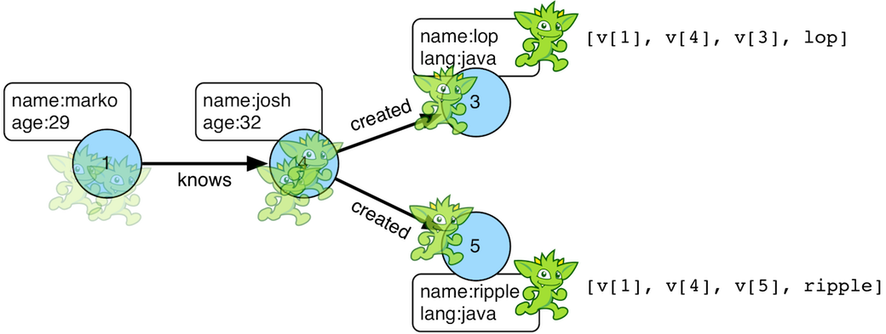

# path步骤

遍历器在遍历的一系列步骤中转换。遍历器的历史路径可以使用`path()`步骤(map)来检查。



```groovy
gremlin> g.V().out().out().values('name')
==>ripple
==>lop
gremlin> g.V().out().out().values('name').path()
==>[v[1],v[4],v[5],ripple]
==>[v[1],v[4],v[3],lop]
```

如果展示边，那么要在遍历器上明确写出边。

```groovy
gremlin> g.V().outE().inV().outE().inV().path()
==>[v[1],e[8][1-knows->4],v[4],e[10][4-created->5],v[5]]
==>[v[1],e[8][1-knows->4],v[4],e[11][4-created->3],v[3]]
```

可以用`by()`对后面的元素以循环的形式进行处理。

```groovy
gremlin> g.V().out().out().path().by('name').by('age')
==>[marko,32,ripple]
==>[marko,32,lop]
```

最后，因为`by()`的后处理，没有什么会阻止触发下一个遍历。在下面的遍历中，所遍历到的每个元素，如果是人(有年龄属性)，那么获取他们所有的作品，或者他是一个作品，就获取他所有的创始人。

```groovy
gremlin> g.V().out().out().path().by(
                            choose(hasLabel('person'),
                                          out('created').values('name'),
                                          __.in('created').values('name')).fold())
==>[[lop],[ripple,lop],[josh]]
==>[[lop],[ripple,lop],[marko,josh,peter]]
```

> 生成路径信息存入一个java列表中的开销很大。对于多个遍历器就有多个列表。然而在OLAP图计算环境下我们会并行的从所有顶点遍历，path步骤就变得无法接受了。在OLAP中我们有一些比较常见的优化手段，但是如果我们使用了path，这些优化手段就都会失效了。

## 路径数据结构

`Path`数据结构是一个对象的有序列表，每个对象都由一个`Set<String>`的标签组成。下面的例子展示了`Path`的API也可以像遍历一样生成标记了的路径。


```groovy
gremlin> path = g.V(1).as('a').has('name').as('b').
                       out('knows').out('created').as('c').
                       has('name','ripple').values('name').as('d').
                       identity().as('e').path().next()
==>v[1]
==>v[4]
==>v[5]
==>ripple
gremlin> path.size()
==>4
gremlin> path.objects()
==>v[1]
==>v[4]
==>v[5]
==>ripple
gremlin> path.labels()
==>[b,a]
==>[]
==>[c]
==>[d,e]
gremlin> path.a
==>v[1]
gremlin> path.b
==>v[1]
gremlin> path.c
==>v[5]
gremlin> path.d == path.e
==>true
```