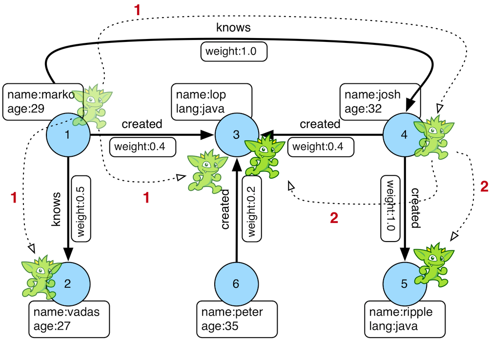

# repeat步骤

`repeat()`步骤(branch)用来循环执行遍历。

```groovy
gremlin> g.V(1).repeat(out()).times(2).path().by('name') //1\
==>[marko,josh,ripple]
==>[marko,josh,lop]
gremlin> g.V().until(has('name','ripple')).
               repeat(out()).path().by('name') //2\
==>[marko,josh,ripple]
==>[josh,ripple]
==>[ripple]
```

1. 执行`out()`2次。
2. 直到遍历到名为“ripple”的顶点。

> `repeat()`有两个模式：`until()`和`emit()`。如果`until()`在`repeat()`之后则表示执行/直到循环。如果`until()`在`repeat()`前则是当/执行循环。如果`emit()`在`repeat()`之后，则会在重复遍历后计算。如果`emit()`放在`repeat()`前，则会在进入遍历器前计算。

`repeat()`步骤也支持“断言”，断言调用一个没有参数的`emit()`时为真。使用`emit()`时，遍历器被分成了两个部分，遍历器退出代码块，也会在代码块中继续返回（假设`until()`为真）。

```groovy
gremlin> g.V(1).repeat(out()).times(2).emit().path().by('name') //1\
==>[marko,lop]
==>[marko,vadas]
==>[marko,josh]
==>[marko,josh,ripple]
==>[marko,josh,lop]
gremlin> g.V(1).emit().repeat(out()).times(2).path().by('name') //2\
==>[marko]
==>[marko,lop]
==>[marko,vadas]
==>[marko,josh]
==>[marko,josh,ripple]
==>[marko,josh,lop]
```

1. `emit()`在`repeat()`之后，因此断言发生在`repeat()`执行后。没有顶点路径存在。
2. `emit()`在`repeat()`前，断言优先级高于`repeat()`调用。因此，有一个顶点路径存在。

`emit()`也可以有多个断言。

```groovy
gremlin> g.V(1).repeat(out()).times(2).emit(has('lang')).path().by('name')
==>[marko,lop]
==>[marko,josh,ripple]
==>[marko,josh,lop]
```



```groovy
gremlin> g.V(1).repeat(out()).times(2).emit().path().by('name')
==>[marko,lop]
==>[marko,vadas]
==>[marko,josh]
==>[marko,josh,ripple]
==>[marko,josh,lop]
```

第一次过`repeat()`，顶点lop、vadas、josh、seen。将`loops==1`，遍历器循环。因为断言为真，这些顶点都通过了。第二次经过`repeat()`，顶点遍历了ripple和lop。将`loops==2`，直到断言失败，ripple和lop通过。因此，遍历器遍历了5个顶点：lop、vadas、josh、ripple、lop。

最后，`emit()`和`until()`都可以跟随一个遍历，在某些条件或断言中决定是否`traversal.hasNext()`。

```groovy
gremlin> g.V(1).repeat(out()).until(hasLabel('software')).path().by('name') //1\
==>[marko,lop]
==>[marko,josh,ripple]
==>[marko,josh,lop]
gremlin> g.V(1).emit(hasLabel('person')).repeat(out()).path().by('name') //2\
==>[marko]
==>[marko,vadas]
==>[marko,josh]
gremlin> g.V(1).repeat(out()).until(outE().count().is(0)).path().by('name') //3\
==>[marko,lop]
==>[marko,vadas]
==>[marko,josh,ripple]
==>[marko,josh,lop]
```

1. 从顶点1开始，保持获取向外边，直到一个软件顶点被遍历到。
2. 从顶点1开始，进入一个无限循环，将人的顶点抛出并遍历向外的边。
3. 从顶点1开始，爆出获取向外的边直到到达一个没有向外边的顶点。

> `emit()`和`until()`的匿名遍历会“本地的”处理他们的对象。在OLAP中，原子操作计算是顶点和他的局部“星图”，重要的是匿名遍历不离开顶点星图的边界。也就是说，他们不能遍历相邻的顶点的属性和边。