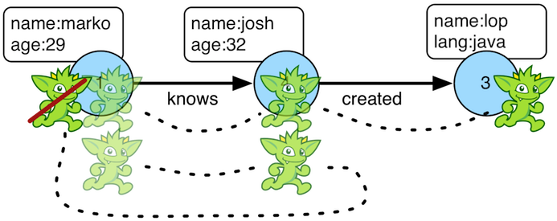

# simplePath步骤



当我们需要遍历器不去重复遍历他已经遍历到的图时，我们就需要使用`simplePath()`步骤(filter)。程序会计算遍历器的路径信息，然后过滤掉路径上有重复对象的遍历。如果需要循环操作，请看`cyclicPath()`。

```groovy
gremlin> g.V(1).both().both()
==>v[1]
==>v[4]
==>v[6]
==>v[1]
==>v[5]
==>v[3]
==>v[1]
gremlin> g.V(1).both().both().simplePath()
==>v[4]
==>v[6]
==>v[5]
==>v[3]
gremlin> g.V(1).both().both().simplePath().path()
==>[v[1],v[3],v[4]]
==>[v[1],v[3],v[6]]
==>[v[1],v[4],v[5]]
==>[v[1],v[4],v[3]]
gremlin> g.V().out().as('a').out().as('b').out().as('c').
           simplePath().by(label).
           path()
gremlin> g.V().out().as('a').out().as('b').out().as('c').
           simplePath().
             by(label).
             from('b').
             to('c').
           path().
             by('name')
```

通过使用`from()`和`to()`模块，遍历器可以确定保证哪一段的路径无环。

```groovy
gremlin> g.addV().property(id, 'A').as('a').
           addV().property(id, 'B').as('b').
           addV().property(id, 'C').as('c').
           addV().property(id, 'D').as('d').
           addE('link').from('a').to('b').
           addE('link').from('b').to('c').
           addE('link').from('c').to('d').iterate()
gremlin> g.V('A').repeat(both().simplePath()).times(3).path() //1\
==>[v[A],v[B],v[C],v[D]]
gremlin> g.V('D').repeat(both().simplePath()).times(3).path() //2\
==>[v[D],v[C],v[B],v[A]]
gremlin> g.V('A').as('a').
           repeat(both().simplePath().from('a')).times(3).as('b').
           repeat(both().simplePath().from('b')).times(3).path() //3\
==>[v[A],v[B],v[C],v[D],v[C],v[B],v[A]]
```

1. 遍历器从顶点A开始的无环路径遍历了3个点
2. 遍历器从顶点D开始有无环路径遍历了3个点
3. 遍历器遍历器从顶点A 3跳到D又3跳回A。这两个路径相交