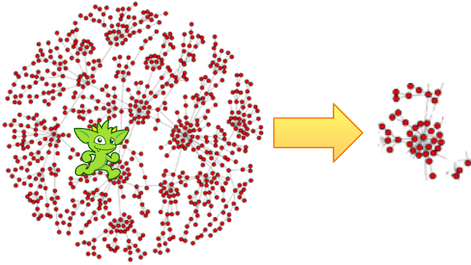

# subgraph步骤



从一个大的图中获取一部分来分析，做可视化或者其他什么操作，对于图分析师与开发者来说是很常见的操作。`subgraph()`步骤(sideEffect)提供了一个创建边导出子图的方法。下面就是一个创建“knows”子图的声明方式：

```groovy
gremlin> subGraph = g.E().hasLabel('knows').subgraph('subGraph').cap('subGraph').next() //1\
==>tinkergraph[vertices:3 edges:2]
gremlin> sg = subGraph.traversal()
==>graphtraversalsource[tinkergraph[vertices:3 edges:2], standard]
gremlin> sg.E() //2\
==>e[7][1-knows->2]
==>e[8][1-knows->4]
```

1. 作为生成“边导出子图”的函数，`subgraph()`必须在边步骤后调用。
2. 这个子图只包含"knows"边。

一个更加通用的子图例子是从一个顶点开始获取指定的图结构。

```groovy
gremlin> subGraph = g.V(3).repeat(__.inE().subgraph('subGraph').outV()).times(3).cap('subGraph').next() //1\
==>tinkergraph[vertices:4 edges:4]
gremlin> sg = subGraph.traversal()
==>graphtraversalsource[tinkergraph[vertices:4 edges:4], standard]
gremlin> sg.E()
==>e[8][1-knows->4]
==>e[9][1-created->3]
==>e[11][4-created->3]
==>e[12][6-created->3]
```

1. 从顶点3开始，遍历三次入边后输出子图。

这里在相同的遍历中多次调用了`subgraph()`。每次操作都针对与相同的图形（同样的副作用键）或不同的图形（不同的副作用键）。

```groovy
gremlin> t = g.V().outE('knows').subgraph('knowsG').inV().outE('created').subgraph('createdG').
                   inV().inE('created').subgraph('createdG').iterate()
gremlin> t.sideEffects.get('knowsG').traversal().E()
==>e[7][1-knows->2]
==>e[8][1-knows->4]
gremlin> t.sideEffects.get('createdG').traversal().E()
==>e[9][1-created->3]
==>e[10][4-created->5]
==>e[11][4-created->3]
==>e[12][6-created->3]
```

> `subgraph()`步骤只会对用户提供id的元素写入。如果图不能使用`withSideEffect()`，我们就会使用`TinkerGraph`。