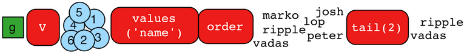

# tail步骤



`tail()`步骤与`limit()`步骤相似，他会去后n个对象，而不是前n个对象。

```groovy
gremlin> g.V().values('name').order()
==>josh
==>lop
==>marko
==>peter
==>ripple
==>vadas
gremlin> g.V().values('name').order().tail() //1\
==>vadas
gremlin> g.V().values('name').order().tail(1) //2\
==>vadas
gremlin> g.V().values('name').order().tail(3) //3\
==>peter
==>ripple
==>vadas
```

1. 最后一个名字（字母序）。
2. 和第一句一样。
3. 最后3个名字。

`tail()`步骤也可以在`Scope.local`使用，用来操作集合中的数据。

```groovy
gremlin> g.V().as('a').out().as('a').out().as('a').select('a').by(tail(local)).values('name') //1\
==>ripple
==>lop
gremlin> g.V().as('a').out().as('a').out().as('a').select('a').by(unfold().values('name').fold()).tail(local) //2\
==>ripple
==>lop
gremlin> g.V().as('a').out().as('a').out().as('a').select('a').by(unfold().values('name').fold()).tail(local, 2) //3\
==>[josh,ripple]
==>[josh,lop]
gremlin> g.V().valueMap().tail(local) //4\
==>[age:[29]]
==>[age:[27]]
==>[lang:[java]]
==>[age:[32]]
==>[lang:[java]]
==>[age:[35]]
```

1. 只有最后一个“a”步骤的名字被处理(`List<Vertex>`成为了`Vertex`)。
2. 和第一句相同(`List<String>`成为了`String`)。
3. `List<String, Object>`从“a”步骤中取出所有路径的最后两个名字。
4. `Map<String, Object>`遍历每个顶点，去除最后的属性值。