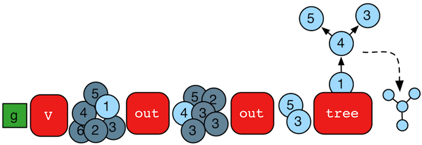

# tree步骤

对于任何的元素（顶点和边），从元素的出发路径可以聚合成一个树。Gremlin提供了`tree()`步骤(sideEffect)来应对这个情况。



```groovy
gremlin> tree = g.V().out().out().tree().next()
==>v[1]={v[4]={v[3]={}, v[5]={}}}
```

观察遍历的路径如何组成一棵路径树非常重要。


这个合成的树数据结构也可以操作。

```groovy
gremlin> tree = g.V().out().out().tree().by('name').next()
==>marko={josh={ripple={}, lop={}}}
gremlin> tree['marko']
==>josh={ripple={}, lop={}}
gremlin> tree['marko']['josh']
==>ripple={}
==>lop={}
gremlin> tree.getObjectsAtDepth(3)
==>ripple
==>lop
```

请注意，当使用`by()`模块时，树节点会根据投影组合唯一，而不是被投影的原始对象唯一。比如说：

```groovy
gremlin> g.V().has('name','josh').out('created').values('name').tree() //1\
==>[v[4]:[v[3]:[lop:[]],v[5]:[ripple:[]]]]
gremlin> g.V().has('name','josh').out('created').values('name').
           tree().by('name').by(label).by() //2\
==>[josh:[software:[ripple:[],lop:[]]]]
```

1. 当`tree()`创建，顶点3和5唯一，因此，树结构就形成了唯一的分支。
2. 当`tree()`使用带`label`的`by()`模块，顶点3和5都是“软件”因此在树中合并成了一个节点。

