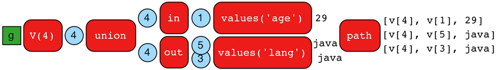

# union步骤



`union()`步骤(branch)支持支持合并多种数值的遍历结果。当遍历器到达`union()`步骤，他被复制进所有的内在步骤。从`union()`出发的遍历是起内部遍历的输出。

```groovy
gremlin> g.V(4).union(
                  __.in().values('age'),
                  out().values('lang'))
==>29
==>java
==>java
gremlin> g.V(4).union(
                  __.in().values('age'),
                  out().values('lang')).path()
==>[v[4],v[1],29]
==>[v[4],v[5],java]
==>[v[4],v[3],java]
```

