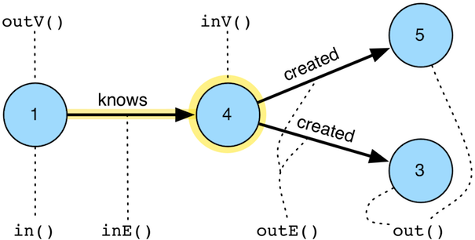

# vertex步骤



`Vertex()`步骤(flatMap)是基于Gremlin语言的。我们通过下面的步骤来在图上进行移动：

- `out(string…)`: 移动到向外指向的临近节点，可以指定边的标签。
- `in(string…)`: 移动到向内指向的临近节点，可以指定边的标签。
- `both(string…)`: 移动到相邻节点，可以指定边的标签。
- `outE(string…)`: 移动到向外指向的边，可以指定边的标签。
- `inE(string…)`: 移动到向内指向的边，可以指定边的标签。
- `bothE(string…)`: 移动到相邻的边，可以指定边的标签。
- `outV()`: 移动到向外指向的节点。
- `inV()`: 移动到向内指向的节点。
- `bothV()`: 移动到相邻节点。
- `otherV()` : 移动到非当前节点。

```groovy
gremlin> g.V(4)
==>v[4]
gremlin> g.V(4).outE() //1\
==>e[10][4-created->5]
==>e[11][4-created->3]
gremlin> g.V(4).inE('knows') //2\
==>e[8][1-knows->4]
gremlin> g.V(4).inE('created') //3\
gremlin> g.V(4).bothE('knows','created','blah')
==>e[10][4-created->5]
==>e[11][4-created->3]
==>e[8][1-knows->4]
gremlin> g.V(4).bothE('knows','created','blah').otherV()
==>v[5]
==>v[3]
==>v[1]
gremlin> g.V(4).both('knows','created','blah')
==>v[5]
==>v[3]
==>v[1]
gremlin> g.V(4).outE().inV() //4\
==>v[5]
==>v[3]
gremlin> g.V(4).out() //5\
==>v[5]
==>v[3]
gremlin> g.V(4).inE().outV()
==>v[1]
gremlin> g.V(4).inE().bothV()
==>v[1]
==>v[4]
```

1. 所有向外的边。
2. 所有向内的knows边。
3. 所有向内的created边。
4. 移动到向外的边和点。
5. 移动到向外的点。